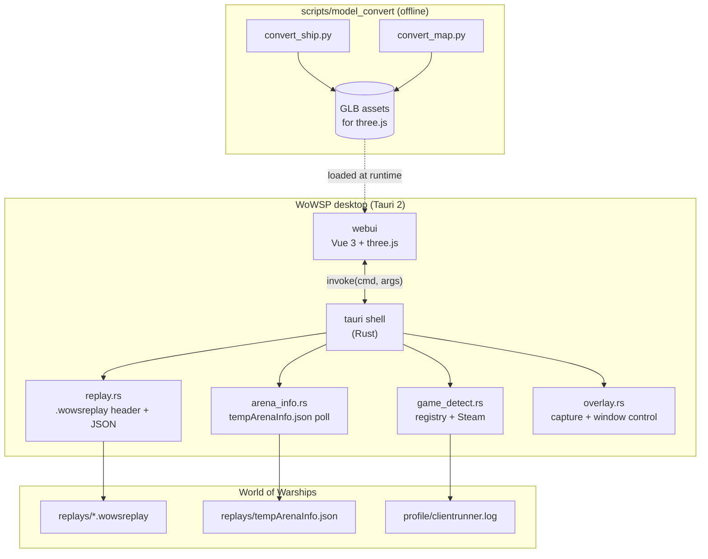

# Architecture

> **Version**: 0.1.0 — Active scaffold development.

## Scope

WoWSP is a Cargo + pnpm monorepo: a Tauri 2 desktop shell (Rust) plus a Vue 3
frontend, with Python tooling for model conversion, a FastAPI mock backend, and
a lagrange documentation site.

| Component | Tech | Role | Status |
| --- | --- | --- | --- |
| **tauri** | Rust + Tauri 2 | Desktop shell: game detection, replay parsing, overlay capture | 🟡 Skeleton |
| **tauri_shared** | Rust | Shared DTOs across the IPC boundary | 🟢 Implemented |
| **webui** | Vue 3 + Vite (TSX) | Frontend: replay review, holographic map, overlay roster | 🟡 Skeleton |
| **mock** | Python + FastAPI | Mock backend for browser/e2e development | 🟡 Skeleton |
| **model_convert** | Python | Ship/map native assets → GLB for three.js | 🟡 Skeleton |
| **docs** | lagrange | Multilingual documentation site | 🟢 en + zhs |

## Architecture diagram

## IPC contract

The webui reaches Rust only through the commands registered in
`packages/app/tauri/src/main.rs`. The command names live in
`packages/webui/src/rpc.ts`; the DTOs live in
`packages/app/tauri_shared/src/lib.rs`. The mock backend mirrors the same
command surface over HTTP under `/api/<cmd>` so the webui code path is identical
between desktop and browser.
