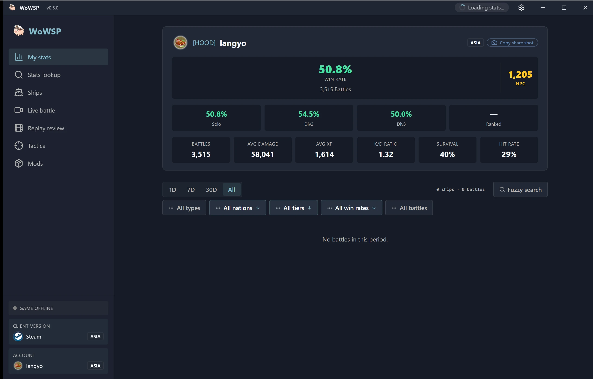

<h1 align="center">WoWSP</h1>

<strong>لوحة معارك مجانية مفتوحة المصدر للعبة World of Warships — مراجعة الريبلاي، وتراكب قوائم الفرق داخل اللعبة، والبحث في الإحصائيات، لنظام Windows.</strong>

[English](../../en/guides/README-wowsp.md) ·
[简体中文](../../zh-CN/guides/README-wowsp.md) ·
[繁體中文](../../zh-TW/guides/README-wowsp.md) ·
[日本語](../../ja/guides/README-wowsp.md) ·
[한국어](../../ko/guides/README-wowsp.md) ·
[Français](../../fr/guides/README-wowsp.md) ·
[Español](../../es/guides/README-wowsp.md) ·
[Русский](../../ru/guides/README-wowsp.md) ·
**العربية**

(تُظهر لقطة الشاشة الواجهة الإنجليزية لأن العربية ليست متاحة بعد ضمن لغات واجهة التطبيق.)

> [!IMPORTANT]
> **برنامج WoWSP مجاني بالكامل ومفتوح المصدر، ويُوزَّع حصريًا عبر صفحة [GitHub Releases](https://github.com/langyo/wowsp/releases) الرسمية. أي شخص يطلب مقابلَه مالًا ليس هو المؤلف — لا تدفع؛ وإن كنت قد دفعت مسبقًا فاطلب استرداد مبلغك وأبلِغ عن البائع.**

WoWSP هو لوحة سطح مكتب للعبة **World of Warships** على نظام Windows. يكتشف تلقائيًا تثبيت اللعبة لديك (مشغّل Wargaming أو Steam أو Lesta أو 360) ويعمل بنمطين:

- **المراجعة المستقلة** — افتح أي ملف `.wowsreplay` وأعد مشاهدة المعركة على خريطة هولوغرامية ثلاثية الأبعاد: مسار كل سفينة، والقذائف، والطوربيدات، والطائرات، إضافةً إلى نتائج المعركة لكل لاعب على حدة، من دون تشغيل اللعبة إطلاقًا.
- **التراكب داخل اللعبة** — أثناء تشغيل اللعبة، استمر بالضغط على `Tab` لرؤية قائمتي الفريقين وإحصائياتهما كطبقة فوق مجرى المعركة؛ ويعيد التراكب تثبيت موضعه عند كل ضغطة.

وإلى جانب هذين النمطين يوفر لك البرنامج أيضًا:

- البحث في إحصائيات اللاعبين والعشائر مع بطاقات مسيرة على نمط «water-meter».
- موسوعة سفن تضم شجرة التطوير الكاملة والمواصفات وعارض التدريع.
- مركز مودات وموارد لأشهر مودات المجتمع.
- تطبيق مرافق لنظام Android يسحب ملفات الريبلاي مباشرة من حاسوبك عبر Wi-Fi، أو من أي مكان عبر رمز اقتران مكوّن من ستة أرقام.

## التحميل

لأنظمة Windows 10/11 — حمّل أحدث إصدار من الملف `WoWSP_<version>_x64-setup-webview2.exe` من [GitHub Releases](https://github.com/langyo/wowsp/releases/latest) (مع تضمين WebView2)، أو استخدم [صفحة التحميل](https://wowsp.langyo.xyz/download) الداعمة للمرايا إذا كان الوصول إلى GitHub بطيئًا في منطقتك. أما نسخة Android فتُبنى من المصدر — راجع [دليل البناء](building.md).

لقطات شاشة لجميع الواجهات، وبكل لغات واجهة المستخدم، متاحة في [معرض الموقع](https://wowsp.langyo.xyz/#gallery).

## الوثائق

تتوفر توثيقات البنية المعمارية وملاحظات التصميم والأدلة في [`docs/`](../../) بتسع لغات (الإنجليزية والصينية المبسطة 简体中文 مترجمتان بالكامل)، وهي مبنية باستخدام [lagrange](https://github.com/celestia-island/lagrange). يرسل WoWSP قدرًا أدنى من بيانات الاستخدام المجهولة — تفاصيل ما يُجمع (وما لا يُجمع أبدًا) موثقة في [إشعار القياس عن بُعد](../license/usage-telemetry.md).

## الملاحظات والشكر

للإبلاغ عن الأخطاء وملاحظات الاختبار: مجموعة QQ رقم **1125770228**، أو نموذج الملاحظات على [الموقع](https://wowsp.langyo.xyz). مبادئ تحليل ملفات الريبلاي واكتشاف اللعبة مقتبسة من [ApeRadar (海猴雷达)](https://github.com/zylalx1/ApeRadar)؛ أما غلاف الواجهة الأمامية وبنية البناء فمقتبسان من [shittim-chest](https://github.com/celestia-island/shittim-chest).

## الترخيص

يُرخَّص WoWSP بموجب **Synthetic Source License 1.0** ([النص الكامل](https://github.com/langyo/wowsp/blob/master/LICENSE)) — منح مكافئة لرخصة Apache-2.0 لقاعدة شيفرة مولَّدة بالذكاء الاصطناعي في معظمها، والالتزام الإضافي الوحيد عليها هو الإبقاء على إشعار الإفصاح عن التوليد بالذكاء الاصطناعي في كل نسخة وكل عمل مشتق. وتحتفظ النسخة المضمّنة من أداة [wows-toolkit](https://github.com/langyo/wowsp/tree/master/packages/tools/wowsunpack-vendor) وخادم [pairing-relay](https://github.com/langyo/wowsp/tree/master/packages/pairing-relay) المستقل برخصتي **MIT** الأصليتين.
