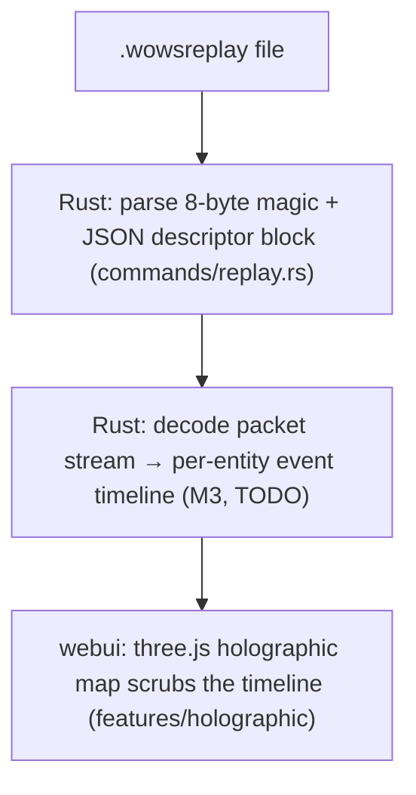
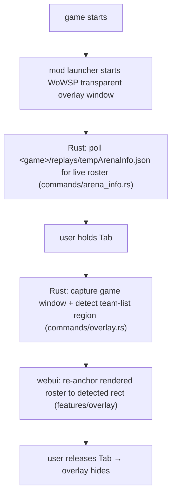

# Architecture

> **Audience**: Developers who need to understand how WoWSP works internally.

## Two operating modes

WoWSP is a single Tauri 2 desktop app with one frontend (Vue 3 + three.js) that
runs in two modes, sharing most of the Rust backend.

### Mode 1 — Standalone review

Open a `.wowsreplay` and watch the whole match rendered on a holographic 3D map,
without launching the game.



Map and ship geometry come from GLB produced by `scripts/model_convert/`
(`convert_map.py`, `convert_ship.py`). Adding a new map or ship = drop the source
asset in `scripts/mock/fixtures/` and re-run the converter — no app change.

### Mode 2 — In-game overlay

A mod file in the game's `res_mods/` launches WoWSP when the game starts. A
transparent always-on-top window overlays both teams' rosters, visible only
while `Tab` is held.



## Game-install detection

`commands/game_detect.rs` scans the Windows Uninstall registry for Wargaming /
Lesta / 360 publishers (mirroring ApeRadar's `ConfigWindow.AutoDetectGamePath`),
then additionally walks Steam library folders for `appmanifest_552990.acf`
(Steam appid 552990 = World of Warships) — the case ApeRadar misses. A manual
path can always be pinned.

## Replay file format

```text
4 bytes  magic       = {0x12, 0x32, 0x34, 0x11}
4 bytes  json_len    = little-endian u32
N bytes  json_block  = match descriptor (roster, map, match type)
4 bytes  meta_count  = u32, number of metadata blocks
...      metadata    = extra metadata blocks
...      packets     = encrypted/zlib packet stream
```

`commands/replay.rs` implements the magic check + JSON block extraction in
Phase 1. The packet-stream decode lands in M3.

## Tech stack

| Layer | Tech |
|---|---|
| Frontend | Vue 3 (TSX) + UnoCSS + co-located SCSS + Pinia + vue-i18n + three.js + echarts |
| Desktop shell | Tauri 2 (Rust) |
| Backend IPC | `#[tauri::command]` handlers in `packages/app/tauri/src/commands/` |
| Mock backend | FastAPI (`scripts/mock/`) for browser/e2e development |
| Build | Cargo + pnpm workspace, `just` recipes, Python tooling |
| Docs | lagrange multilingual site |

## Provenance

The replay-parsing, game-detection, and `tempArenaInfo.json` polling principles
are adapted from [ApeRadar (海猴雷达)](https://github.com/zylalx1/ApeRadar). The
frontend shell, build infrastructure, and licensing model are adapted from
[shittim-chest](https://github.com/celestia-island/shittim-chest).
