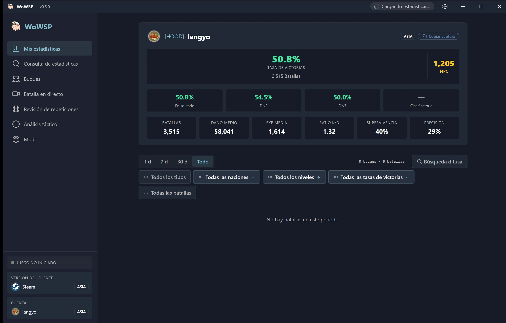

<h1 align="center">WoWSP</h1>

<strong>Panel de batalla gratuito y de código abierto para World of Warships — revisión de replays, superposición en el juego, información de batalla en vivo y estadísticas completas, para Windows y Android.</strong>

[English](../../en/guides/README-wowsp.md) ·
[简体中文](../../zh-CN/guides/README-wowsp.md) ·
[繁體中文](../../zh-TW/guides/README-wowsp.md) ·
[日本語](../../ja/guides/README-wowsp.md) ·
[한국어](../../ko/guides/README-wowsp.md) ·
[Français](../../fr/guides/README-wowsp.md) ·
**Español** ·
[Русский](../../ru/guides/README-wowsp.md) ·
[العربية](../../ar/guides/README-wowsp.md)

> [!IMPORTANT]
> **WoWSP es completamente gratuito y de código abierto, y se distribuye únicamente a través de las [GitHub Releases](https://github.com/langyo/wowsp/releases) oficiales. Cualquiera que cobre dinero por él no es el autor: no pagues; si ya lo has hecho, solicita un reembolso y denuncia al vendedor.**

WoWSP es un panel de escritorio para **World of Warships** en Windows, con una aplicación complementaria de Android. Detecta automáticamente tu instalación del juego —el Game Center de Wargaming, Steam, Lesta o 360— y te acompaña en todo el ciclo: revisar la partida después, verla en vivo y leer las probabilidades mientras juegas.

## Qué incluye

- **Revisión de replays** — abre cualquier `.wowsreplay` y vuelve a ver la partida en un mapa 3D holográfico: la trayectoria de cada buque, los proyectiles, los torpedos y los escuadrones de aviones, los anillos de alcance, el clima de ciclón y la simulación de zonas de captura. Cámaras de órbita libre, de grabación original y de seguimiento de buque; etiquetas del mapa que se mantienen legibles por sí solas; y los resultados de batalla de cada jugador (cintas, logros y composición del daño) junto al mapa. Cada panel exporta una captura para compartir que puede ocultar los apodos, y la biblioteca filtra por modo, fecha y estado de archivado.
- **Superposición en el juego** — mantén pulsado `Tab` en combate para superponer la alineación y las estadísticas de ambos equipos sobre la partida; la superposición se vuelve a anclar con cada pulsación. Niveles de valoración personal (PR) y colores de winrate, sellos, tinte de las filas de buques hundidos, resúmenes de equipo e información de consumibles al mantener `Tab`. Las estadísticas se muestran en una ventana transparente sobre la tabla detectada o dentro del propio juego mediante el plugin de primera parte incluido, con la coincidencia de filas ajustada para cada cliente (Wargaming, Lesta y el cliente CN).
- **Monitor de batalla en vivo** — desde la pantalla de carga hasta la pantalla de resultados, observa cómo se desarrolla la batalla: alineaciones completas con niveles de valoración personal (PR) y etiquetas de clan, winrate de equipo ponderado por nivel, tarjetas de combate y un informe de batalla personal en vivo que registra tu propio daño, tus logros y la atribución de tus hundimientos.
- **Panel de estadísticas y tiempo de juego** — tu propio «water meter»: tarjetas de valoración personal (PR), winrate y daño medio con rangos de fechas, gráficos de distribución de buques (histograma de niveles, donas por clase y nación), historial de temporadas clasificatorias y cambio entre cuentas múltiples. Una vista dedicada al tiempo de juego convierte tus archivos de replay en un mapa de calor de calendario de batallas con selector de año.
- **Consulta de jugadores y clanes** — busca cualquier jugador o clan (con soporte de pinyin), lee tarjetas de carrera y alineaciones de clan con capturas para compartir, y cruza las alineaciones de las Batallas en Clan entre servidores.
- **Enciclopedia de buques y planificador de builds** — el árbol tecnológico completo con conmutador de rama Wargaming/Lesta, vistas de especificaciones y blindaje, tendencias de servidor por buque, escenas de modelos 3D de buques y aviones, y un planificador de builds que proyecta las habilidades de capitán, los comandantes, las señales y las mejoras en especificaciones finales, con el cálculo de costes en créditos y XP.
- **Centro de mods** — un mercado seleccionado de mods de la comunidad en las categorías de función, textura y voz (skins de buques, paquetes de voz Wwise con vistas previas), con preajustes de instalación, modo seguro de un clic, avisos de conflictos, migración de mods obsoletos, análisis de anulaciones de texturas y actualizaciones por lotes.
- **Tablero de tácticas** *(en desarrollo)* — un editor de planes tácticos sobre el catálogo de mapas de batalla incluido: un reloj de planificación de 20 minutos, trayectorias de unidades, líneas de tiempo de acciones y conjuntos de planes para compartir.
- **Aplicación complementaria de Android** — empareja tu teléfono por Wi-Fi (detección automática) o desde cualquier lugar mediante un código de emparejamiento de seis dígitos a través del relay integrado, extrae los replays directamente de tu equipo y revísalos sobre la marcha.

Bajo el capó sigue siendo un ciudadano nativo: actualizaciones automáticas por carrera de espejos (instalaciones portátiles compatibles), un panel en la bandeja del sistema, un asistente de primeros pasos, anuncios dentro de la aplicación y un formulario de comentarios con exportación de registros; temas, fondos de pantalla, opacidad de la interfaz, tamaño de fuente y controles de DPI; nueve idiomas de interfaz; una telemetría anónima y mínima que puedes desactivar; y un WebView2 incluido que se degrada con elegancia cuando falta.

## Descarga

Windows 10/11 — descarga el último `WoWSP_<version>_x64-installer-webview2.exe` desde [GitHub Releases](https://github.com/langyo/wowsp/releases/latest) (WebView2 va incluido), o usa la [página de descarga](https://wowsp.langyo.xyz/download) con espejos si GitHub te resulta lento en tu zona. La edición de Android se compila a partir del código fuente; consulta la [guía de compilación](building.md).

Las capturas de pantalla de todas las vistas, en todos los idiomas de la interfaz, están en la [galería del sitio web](https://wowsp.langyo.xyz/#gallery).

## Documentación

La arquitectura, las notas de diseño y las guías se encuentran en [`docs/`](../../) en nueve idiomas (inglés y 简体中文 completamente traducidos), compiladas con [lagrange](https://github.com/celestia-island/lagrange). WoWSP envía una telemetría de uso anónima y mínima — lo que se recopila (y lo que nunca se recopila) se detalla en el [aviso de telemetría](../license/usage-telemetry.md).

## Comentarios y créditos

Errores y comentarios de las pruebas: grupo de QQ **[1125770228](https://qm.qq.com/cgi-bin/qm/qr?k=b6kMIecv3d390ecZVWNQNWMFfLRVgcQ9&jump_from=webapi&authKey=NhNLVnIcIlmfnnDUCjpsra4C/zfciS1sYNjm5SV7x2RPhdP1CzOM91ObP9y9MMQV)**, o el formulario de comentarios del [sitio web](https://wowsp.langyo.xyz). El análisis de replays y los principios de detección del juego están adaptados de [ApeRadar (海猴雷达)](https://github.com/zylalx1/ApeRadar); la shell del frontend y la infraestructura de compilación están adaptadas de [shittim-chest](https://github.com/celestia-island/shittim-chest).

## Licencia

WoWSP se distribuye bajo la **Synthetic Source License 1.0** ([texto completo](https://github.com/langyo/wowsp/blob/master/LICENSE)) — otorga permisos equivalentes a los de Apache-2.0 para una base de código sustancialmente generada por IA, cuya única obligación adicional es mantener el aviso de divulgación de generación por IA en cada copia y obra derivada. La instantánea de [wows-toolkit](https://github.com/langyo/wowsp/tree/master/packages/tools/wowsunpack-vendor) integrada en el repositorio conserva su licencia **MIT** original; todo lo demás en este repositorio —incluido el worker independiente [pairing-relay](https://github.com/langyo/wowsp/tree/master/packages/pairing-relay)— está cubierto por la SySL-1.0.

## Apoyar al autor

WoWSP es y seguirá siendo gratuito. Si crees que se lo ha ganado y quieres ayudar, la página de afdian del autor es **[afdian.com/a/langyo](https://afdian.com/a/langyo)** — **cada donación se destina íntegramente a los costes de IA del desarrollo de WoWSP** (llamadas a modelos y herramientas de generación de código).

Para que las responsabilidades queden claras:

- Donar es completamente opcional y nunca obligatorio: todas las funciones son gratuitas y la aplicación nunca incluirá funciones que requieran una donación.
- Una donación es un regalo voluntario: no crea ninguna relación laboral, de encargo ni de ningún otro tipo jurídico, y no otorga derecho alguno sobre funciones concretas, plazos de entrega ni reembolsos.
- El proyecto sigue siendo de código abierto bajo la licencia anterior, para todos: donantes y no donantes por igual.
- WoWSP es un proyecto independiente y no oficial, sin relación directa con Wargaming, Lesta ni 360.
