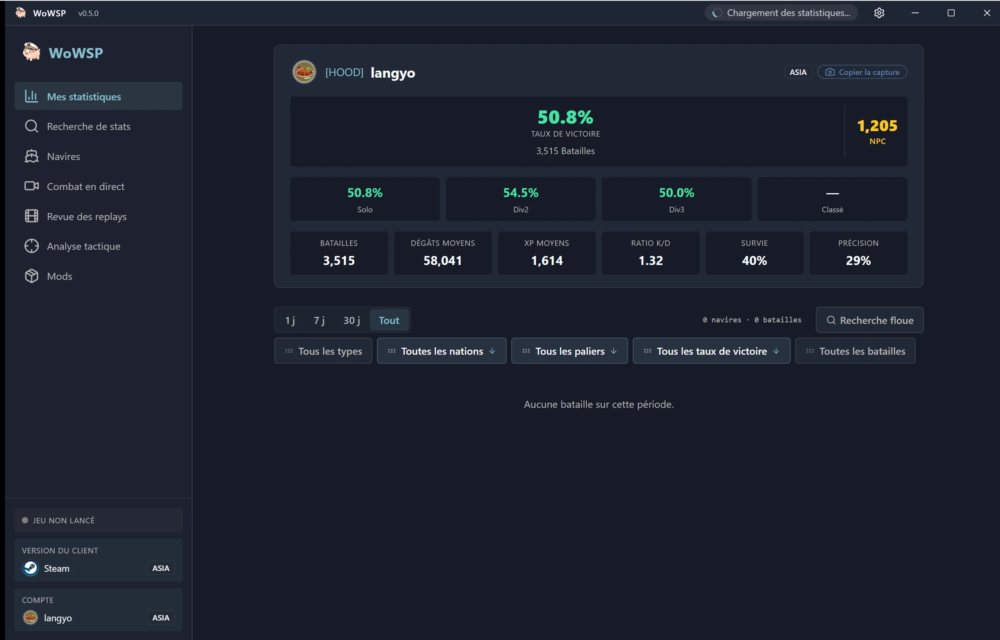

<h1 align="center">WoWSP</h1>

<strong>Panneau de bataille libre et open source pour World of Warships — revue des replays, overlay des compositions en jeu et consultation de statistiques, pour Windows.</strong>

[English](../../en/guides/README-wowsp.md) ·
[简体中文](../../zh-CN/guides/README-wowsp.md) ·
[繁體中文](../../zh-TW/guides/README-wowsp.md) ·
[日本語](../../ja/guides/README-wowsp.md) ·
[한국어](../../ko/guides/README-wowsp.md) ·
**Français** ·
[Español](../../es/guides/README-wowsp.md) ·
[Русский](../../ru/guides/README-wowsp.md) ·
[العربية](../../ar/guides/README-wowsp.md)

> [!IMPORTANT]
> **WoWSP est entièrement gratuit et open source, distribué uniquement via les [GitHub Releases](https://github.com/langyo/wowsp/releases) officiels. Quiconque le vend n'en est pas l'auteur — ne payez pas ; si c'est déjà fait, demandez un remboursement et signalez le vendeur.**

WoWSP est un panneau de bureau pour **World of Warships** sous Windows. Il détecte automatiquement votre installation du jeu (lanceur Wargaming, Steam, Lesta ou 360) et fonctionne selon deux modes :

- **Revue autonome** — ouvrez n'importe quel `.wowsreplay` et revoyez la partie sur une carte 3D holographique : trajectoire de chaque navire, obus, torpilles et avions, plus les résultats de bataille joueur par joueur, sans jamais lancer le jeu.
- **Overlay en jeu** — pendant que la partie tourne, maintenez `Tab` pour afficher la composition et les statistiques des deux équipes superposées au match ; l'overlay se réancre à chaque pression de la touche.

Autour de ces deux modes, il vous propose également :

- Recherche des statistiques de joueurs et de clans, avec fiches de carrière « compteur d'eau ».
- Une encyclopédie des navires avec l'arbre technologique complet, les caractéristiques et une visionneuse de blindage.
- Un hub de mods et un centre de ressources pour les mods communautaires populaires.
- Une application compagnon Android qui récupère les replays directement depuis votre ordinateur via Wi-Fi, ou depuis n'importe où grâce à un code d'appairage à six chiffres.

## Téléchargement

Windows 10/11 — récupérez le dernier `WoWSP_<version>_x64-setup-webview2.exe` depuis [GitHub Releases](https://github.com/langyo/wowsp/releases/latest) (WebView2 est inclus), ou la [page de téléchargement](https://wowsp.langyo.xyz/download), qui choisit automatiquement un miroir, si GitHub est lent depuis votre région. L'édition Android se compile à partir des sources — consultez le [guide de compilation](building.md).

Des captures d'écran de chaque vue, dans chaque langue de l'interface, sont disponibles dans la [galerie du site](https://wowsp.langyo.xyz/#gallery).

## Documentation

L'architecture, les notes de conception et les guides se trouvent dans [`docs/`](../../) en neuf langues (anglais et 简体中文 entièrement traduits), construits avec [lagrange](https://github.com/celestia-island/lagrange). WoWSP envoie une télémétrie d'usage anonyme et minimale — ce qui est collecté (et ce qui ne l'est jamais) est détaillé dans [cette note de télémétrie](../license/usage-telemetry.md).

## Retours et crédits

Retours de bogues et de tests : groupe QQ **1125770228**, ou le formulaire de retours sur le [site](https://wowsp.langyo.xyz). L'analyse des replays et les principes de détection du jeu sont adaptés d'[ApeRadar (海猴雷达)](https://github.com/zylalx1/ApeRadar) ; le shell frontend et l'infrastructure de compilation sont adaptés de [shittim-chest](https://github.com/celestia-island/shittim-chest).

## Licence

WoWSP est distribué sous la **Synthetic Source License 1.0** ([texte intégral](https://github.com/langyo/wowsp/blob/master/LICENSE)) — des droits équivalents à ceux d'Apache-2.0 pour une base de code substantiellement générée par IA, dont la seule obligation supplémentaire est de conserver la mention de divulgation de génération par IA sur chaque copie et chaque œuvre dérivée. L'instantané « vendored » de [wows-toolkit](https://github.com/langyo/wowsp/tree/master/packages/tools/wowsunpack-vendor) et le worker autonome [pairing-relay](https://github.com/langyo/wowsp/tree/master/packages/pairing-relay) conservent leurs licences **MIT** d'origine.
