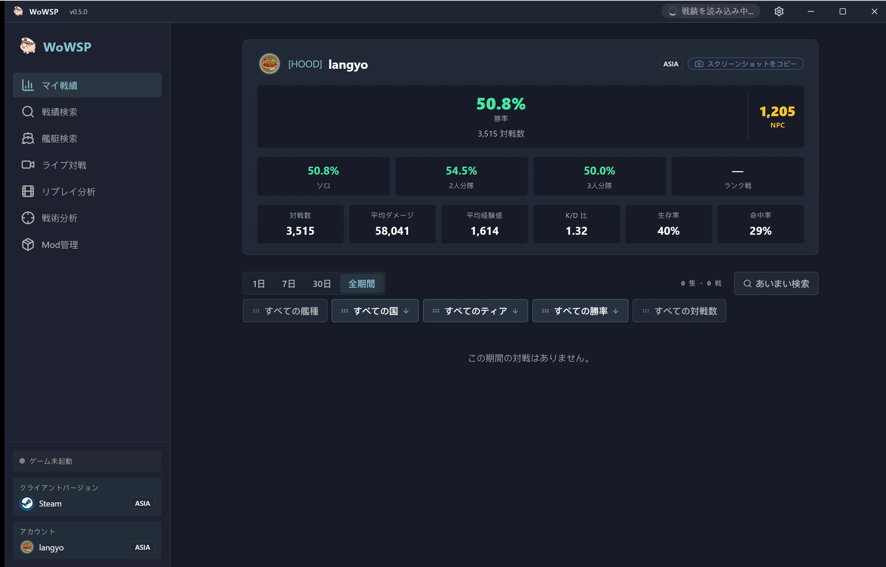

<h1 align="center">WoWSP</h1>

<strong>ワールド・オブ・ウォーシップス（World of Warships）向けの無料オープンソース バトルパネル — リプレイレビュー、ゲーム内編成オーバーレイ、戦績検索に対応（Windows 用）。</strong>

[English](../../en/guides/README-wowsp.md) ·
[简体中文](../../zh-CN/guides/README-wowsp.md) ·
[繁體中文](../../zh-TW/guides/README-wowsp.md) ·
**日本語** ·
[한국어](../../ko/guides/README-wowsp.md) ·
[Français](../../fr/guides/README-wowsp.md) ·
[Español](../../es/guides/README-wowsp.md) ·
[Русский](../../ru/guides/README-wowsp.md) ·
[العربية](../../ar/guides/README-wowsp.md)

> [!IMPORTANT]
> **WoWSP は完全無料のオープンソースであり、公式の [GitHub Releases](https://github.com/langyo/wowsp/releases) のみで配布される。金銭を要求してくる者は作者ではない — 支払わないこと。すでに支払ってしまった場合は返金を要求し、販売者を通報すること。**

WoWSP は Windows 向けの **World of Warships** デスクトップパネルである。ゲームのインストール環境（Wargaming ランチャー、Steam、Lesta、360 のいずれか）を自動検出し、次の 2 つのモードで動作する。

- **スタンドアロンレビュー** — 任意の `.wowsreplay` を開くと、ホログラフィック 3D マップ上で試合を再視聴できる。ゲームを一切起動せずに、全艦艇の航跡・砲弾・魚雷・航空機に加え、プレイヤーごとの戦闘結果まで確認可能。
- **ゲーム内オーバーレイ** — ゲーム実行中に `Tab` を押し続けると、試合画面上に両チームの編成と戦績が重ねて表示される。オーバーレイは押下のたびに再アンカーされる。

これら 2 つのモードに加え、以下の機能も提供する。

- ウォーターメーター式キャリアカードによるプレイヤー・クラン戦績検索。
- 全テックツリー、性能諸元、装甲ビューアを備えた艦艇百科。
- 人気コミュニティ MOD を集めた MOD ハブとリソースセンター。
- Wi-Fi 経由でデスクトップから直接リプレイを取得できる Android コンパニオン。6 桁のペアリングコードを使えば場所を問わず視聴可能。

## ダウンロード

Windows 10/11 — [GitHub Releases](https://github.com/langyo/wowsp/releases/latest) から最新の `WoWSP_<version>_x64-setup-webview2.exe` を入手（WebView2 同梱）。GitHub が遅い地域では、ミラー対応の[ダウンロードページ](https://wowsp.langyo.xyz/download)を利用。Android 版はソースからビルドする — [ビルドガイド](building.md)を参照。

全ビュー・全 UI 言語のスクリーンショットは[ウェブサイトのギャラリー](https://wowsp.langyo.xyz/#gallery)で公開。

## ドキュメント

アーキテクチャ、設計メモ、各種ガイドは [`docs/`](../../) に 9 言語で格納されている（英語と简体中文が完全翻訳済み）。[lagrange](https://github.com/celestia-island/lagrange) で構築。 WoWSP は最小限の匿名利用テレメトリを送信します — 収集内容（と収集しない内容）の詳細は[テレメトリに関するお知らせ](../license/usage-telemetry.md)を参照してください。

## フィードバックとクレジット

バグ報告とテストフィードバックは QQ グループ **1125770228**、または[ウェブサイト](https://wowsp.langyo.xyz)のフィードバックフォームへ。リプレイ解析とゲーム検出の原理は [ApeRadar（海猴雷达）](https://github.com/zylalx1/ApeRadar) から、フロントエンドシェルとビルド基盤は [shittim-chest](https://github.com/celestia-island/shittim-chest) から採用している。

## ライセンス

WoWSP は **Synthetic Source License 1.0**（[全文](https://github.com/langyo/wowsp/blob/master/LICENSE)）の下で提供される — 実質的に AI 生成のコードベースに対して Apache-2.0 と同等の許諾を与えるライセンスであり、追加の義務はコピーおよび派生物すべてに AI 生成である旨の表示を維持することのみ。リポジトリにベンダー取り込みした [wows-toolkit](https://github.com/langyo/wowsp/tree/master/packages/tools/wowsunpack-vendor) スナップショットと、スタンドアロンの [pairing-relay](https://github.com/langyo/wowsp/tree/master/packages/pairing-relay) ワーカーは上流の **MIT** ライセンスを維持する。
