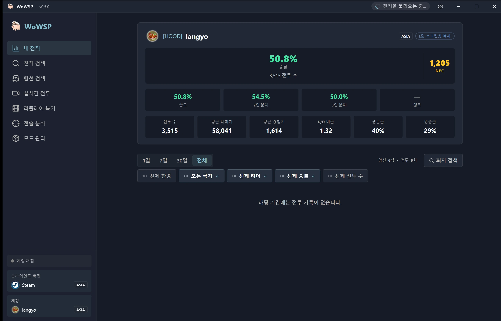

<h1 align="center">WoWSP</h1>

<strong>월드 오브 워십을 위한 무료 오픈소스 전투 패널 — 리플레이 리뷰, 게임 내 팀 명단 오버레이, 전적 조회 (Windows용).</strong>

[English](../../en/guides/README-wowsp.md) ·
[简体中文](../../zh-CN/guides/README-wowsp.md) ·
[繁體中文](../../zh-TW/guides/README-wowsp.md) ·
[日本語](../../ja/guides/README-wowsp.md) ·
**한국어** ·
[Français](../../fr/guides/README-wowsp.md) ·
[Español](../../es/guides/README-wowsp.md) ·
[Русский](../../ru/guides/README-wowsp.md) ·
[العربية](../../ar/guides/README-wowsp.md)

> [!IMPORTANT]
> **WoWSP는 완전히 무료인 오픈소스로, 공식 [GitHub Releases](https://github.com/langyo/wowsp/releases)를 통해서만 배포된다. 이 프로그램에 돈을 요구하는 사람은 작성자가 아니다 — 결제하지 말고, 이미 결제했다면 환불을 요청하고 판매자를 신고하기 바란다.**

WoWSP는 Windows용 **월드 오브 워십** 데스크톱 패널이다. 게임 설치(Wargaming 런처, Steam, Lesta, 360)를 자동으로 감지하며, 두 가지 모드로 동작한다:

- **리플레이 단독 리뷰** — 아무 `.wowsreplay` 파일이나 열어 홀로그램 3D 맵에서 전투를 다시 본다. 게임을 실행하지 않고도 모든 함선의 항적, 포탄, 어뢰, 항공기는 물론 플레이어별 전투 결과까지 확인할 수 있다.
- **게임 내 오버레이** — 게임 실행 중 `Tab`을 누르고 있으면 전투 화면 위에 양 팀의 명단과 전적이 겹쳐 표시된다. 오버레이는 키를 누를 때마다 위치를 다시 고정한다.

이 두 가지 외에도 다음 기능을 제공한다:

- 워터미터(water-meter) 커리어 카드가 포함된 플레이어·클랜 전적 조회.
- 전체 테크 트리, 제원, 장갑 뷰어를 갖춘 함선 백과사전.
- 인기 커뮤니티 모드를 위한 모드 허브와 리소스 센터.
- Wi-Fi로 데스크톱에서 리플레이를 바로 가져오거나, 6자리 페어링 코드로 어디서든 접속하는 Android 컴패니언 앱.

## 다운로드

Windows 10/11 — [GitHub Releases](https://github.com/langyo/wowsp/releases/latest)에서 최신 `WoWSP_<version>_x64-setup-webview2.exe`를 내려받는다(WebView2 포함). GitHub 접속이 느린 환경에서는 미러를 지원하는 [다운로드 페이지](https://wowsp.langyo.xyz/download)를 이용한다. Android 버전은 소스에서 직접 빌드한다 — [빌드 가이드](building.md) 참고.

모든 화면의 스크린샷은 UI 언어별로 [웹사이트 갤러리](https://wowsp.langyo.xyz/#gallery)에서 볼 수 있다.

## 문서

아키텍처, 설계 노트, 가이드는 [`docs/`](../../)에 아홉 개 언어로 정리되어 있다(영어와 简体中文은 완역). 문서는 [lagrange](https://github.com/celestia-island/lagrange)로 빌드했다. WoWSP는 최소한의 익명 사용 텔레메트리를 전송합니다 — 수집 항목(및 수집하지 않는 항목)의 자세한 내용은 [텔레메트리 안내](../license/usage-telemetry.md)를 참고하세요.

## 피드백 및 크레딧

버그 및 테스트 피드백: QQ 그룹 **[1125770228](https://qm.qq.com/cgi-bin/qm/qr?k=b6kMIecv3d390ecZVWNQNWMFfLRVgcQ9&jump_from=webapi&authKey=NhNLVnIcIlmfnnDUCjpsra4C/zfciS1sYNjm5SV7x2RPhdP1CzOM91ObP9y9MMQV)**, 또는 [웹사이트](https://wowsp.langyo.xyz)의 피드백 폼. 리플레이 파싱과 게임 감지 원리는 [ApeRadar (海猴雷达)](https://github.com/zylalx1/ApeRadar)에서, 프론트엔드 셸과 빌드 인프라는 [shittim-chest](https://github.com/celestia-island/shittim-chest)에서 가져와 적용했다.

## 라이선스

WoWSP는 **Synthetic Source License 1.0**([전문](https://github.com/langyo/wowsp/blob/master/LICENSE)) 하에 배포된다 — 상당 부분 AI가 생성한 코드베이스에 Apache-2.0과 동등한 권리를 부여하며, 유일한 추가 의무는 모든 복제본과 파생물에 AI 생성 고지 문구를 유지하는 것이다. 벤더링한 [wows-toolkit](https://github.com/langyo/wowsp/tree/master/packages/tools/wowsunpack-vendor) 스냅샷과 독립 실행형 [pairing-relay](https://github.com/langyo/wowsp/tree/master/packages/pairing-relay) 워커는 업스트림 **MIT** 라이선스를 그대로 유지한다.
