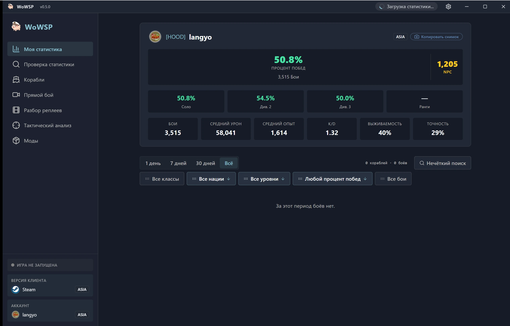

<h1 align="center">WoWSP</h1>

<strong>Бесплатная панель боя с открытым исходным кодом для игры «Мир кораблей» (World of Warships) — разбор реплеев, внутриигровое наложение с составами команд и поиск статистики для Windows.</strong>

[English](../../en/guides/README-wowsp.md) ·
[简体中文](../../zh-CN/guides/README-wowsp.md) ·
[繁體中文](../../zh-TW/guides/README-wowsp.md) ·
[日本語](../../ja/guides/README-wowsp.md) ·
[한국어](../../ko/guides/README-wowsp.md) ·
[Français](../../fr/guides/README-wowsp.md) ·
[Español](../../es/guides/README-wowsp.md) ·
**Русский** ·
[العربية](../../ar/guides/README-wowsp.md)

> [!IMPORTANT]
> **WoWSP полностью бесплатен и распространяется с открытым исходным кодом исключительно через официальные [GitHub Releases](https://github.com/langyo/wowsp/releases). Любой, кто продаёт его за деньги, не является автором — не платите; если вы уже заплатили, потребуйте возврат средств и сообщите о продавце.**

WoWSP — настольная панель для **«Мира кораблей»** под Windows. Она автоматически определяет установленную игру (лаунчер Wargaming, Steam, Lesta или 360) и работает в двух режимах:

- **Автономный разбор** — откройте любой файл `.wowsreplay` и пересмотрите бой на голографической 3D-карте: траектории каждого корабля, снаряды, торпеды и самолёты, а также результаты боя по каждому игроку — вовсе не запуская игру.
- **Внутриигровое наложение** — пока идёт бой, удерживайте `Tab`, чтобы поверх экрана видеть составы и статистику обеих команд; при каждом нажатии наложение заново привязывается к экрану.

Помимо этих двух режимов, WoWSP также предлагает:

- Поиск статистики игроков и кланов с карточками карьеры в стиле «водомера».
- Энциклопедию кораблей с полным деревом исследования, характеристиками и просмотром схемы бронирования.
- Центр модов и ресурсов с популярными модификациями от сообщества.
- Компаньона для Android, который загружает реплеи прямо с вашего настольного компьютера по Wi-Fi или откуда угодно по шестизначному коду сопряжения.

## Скачать

Для Windows 10/11 — скачайте свежий `WoWSP_<version>_x64-installer-webview2.exe` из [GitHub Releases](https://github.com/langyo/wowsp/releases/latest) (WebView2 уже включён в комплект) или воспользуйтесь [страницей загрузки](https://wowsp.langyo.xyz/download) с зеркалами, если GitHub у вас работает медленно. Версия для Android собирается из исходников — см. [руководство по сборке](building.md).

Скриншоты всех экранов на всех языках интерфейса доступны в [галерее на сайте](https://wowsp.langyo.xyz/#gallery).

## Документация

Архитектура, заметки о проектировании и руководства находятся в каталоге [`docs/`](../../) на девяти языках (английский и 简体中文 переведены полностью); документация собирается с помощью [lagrange](https://github.com/celestia-island/lagrange). WoWSP отправляет минимальную анонимную телеметрию использования — что именно собирается (и что никогда не собирается), описано в [уведомлении о телеметрии](../license/usage-telemetry.md).

## Обратная связь и благодарности

Сообщения об ошибках и отзывы по тестированию: QQ-группа **[1125770228](https://qm.qq.com/cgi-bin/qm/qr?k=b6kMIecv3d390ecZVWNQNWMFfLRVgcQ9&jump_from=webapi&authKey=NhNLVnIcIlmfnnDUCjpsra4C/zfciS1sYNjm5SV7x2RPhdP1CzOM91ObP9y9MMQV)** либо форма обратной связи на [сайте](https://wowsp.langyo.xyz). Принципы разбора реплеев и определения игровой установки адаптированы из проекта [ApeRadar (海猴雷达)](https://github.com/zylalx1/ApeRadar); оболочка фронтенда и инфраструктура сборки адаптированы из проекта [shittim-chest](https://github.com/celestia-island/shittim-chest).

## Лицензия

WoWSP распространяется по лицензии **Synthetic Source License 1.0** ([полный текст](https://github.com/langyo/wowsp/blob/master/LICENSE)) — она предоставляет права уровня Apache-2.0 для существенно сгенерированной ИИ кодовой базы, а её единственное дополнительное обязательство — сохранять уведомление о генерации ИИ в каждой копии и производной работе. Вендорный снапшот [wows-toolkit](https://github.com/langyo/wowsp/tree/master/packages/tools/wowsunpack-vendor) и автономный воркер [pairing-relay](https://github.com/langyo/wowsp/tree/master/packages/pairing-relay) сохраняют свои исходные лицензии **MIT**.
