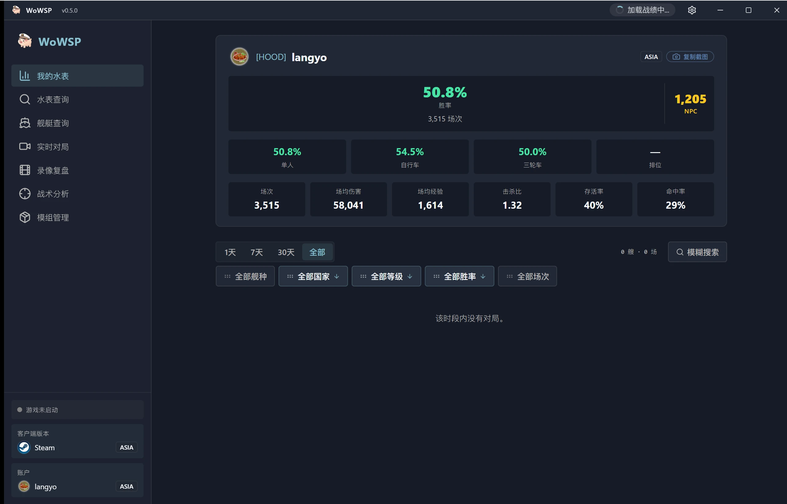

<h1 align="center">WoWSP</h1>

<strong>免费开源的《战舰世界》战况面板 —— 录像复盘、游戏内阵容覆盖层、战绩查询，Windows 桌面应用。</strong>

[English](../../en/guides/README-wowsp.md) ·
**简体中文** ·
[繁體中文](../../zh-TW/guides/README-wowsp.md) ·
[日本語](../../ja/guides/README-wowsp.md) ·
[한국어](../../ko/guides/README-wowsp.md) ·
[Français](../../fr/guides/README-wowsp.md) ·
[Español](../../es/guides/README-wowsp.md) ·
[Русский](../../ru/guides/README-wowsp.md) ·
[العربية](../../ar/guides/README-wowsp.md)

> [!IMPORTANT]
> **WoWSP 完全免费且开源，仅通过官方 [GitHub Releases](https://github.com/langyo/wowsp/releases) 分发。任何渠道收费出售均与作者无关——请勿付款；如已付费，请尽快申请退款并举报卖家。**

WoWSP 是 Windows 上的《战舰世界》桌面面板。它会自动检测游戏安装（Wargaming 官方启动器 / Steam / Lesta / 360），以两种模式工作：

- **独立复盘** —— 打开任意 `.wowsreplay`，在全息 3D 地图上重演整场对局：每艘船的航迹、炮弹、鱼雷与飞机，以及每位玩家的战斗结果，全程无需启动游戏。
- **游戏内覆盖层** —— 游戏运行时按住 `Tab`，即可在游戏画面上叠看双方阵容与战绩；每次按键都会重新锚定位置。

围绕这两种模式，它还提供：

- 玩家与军团战绩查询，带「水表」生涯卡片。
- 舰船百科：完整科技树、舰船参数与装甲视图。
- 模组中心与资源页，收录常用社区模组。
- Android 伴侣端：局域网自动发现桌面端直接拉取录像，或用六位配对码远程配对。

## 下载

Windows 10/11 —— 从 [GitHub Releases](https://github.com/langyo/wowsp/releases/latest) 下载最新的 `WoWSP_<version>_x64-installer-webview2.exe`（安装器自带 WebView2）；GitHub 访问缓慢时可改用官网的 [下载页](https://wowsp.langyo.xyz/download)（内置加速镜像）。Android 版需从源码构建，见[构建指南](building.md)。

所有界面、所有语言下的截图都在[官网画廊](https://wowsp.langyo.xyz/#gallery)。

## 文档

架构、设计与指南位于仓库的 [`docs/`](../../) 目录，共九种语言（英文与简体中文完整翻译），由 [lagrange](https://github.com/celestia-island/lagrange) 构建。 WoWSP 会上报极少量的匿名使用遥测——具体收集（与绝不收集）什么见[遥测说明](../license/usage-telemetry.md)。

## 反馈与致谢

Bug 与测试反馈：QQ 群 **[1125770228](https://qm.qq.com/cgi-bin/qm/qr?k=b6kMIecv3d390ecZVWNQNWMFfLRVgcQ9&jump_from=webapi&authKey=NhNLVnIcIlmfnnDUCjpsra4C/zfciS1sYNjm5SV7x2RPhdP1CzOM91ObP9y9MMQV)**，或[官网](https://wowsp.langyo.xyz)的反馈表单。录像解析与游戏检测原理改编自 [ApeRadar（海猴雷达）](https://github.com/zylalx1/ApeRadar)；前端外壳与构建基建改编自 [shittim-chest](https://github.com/celestia-island/shittim-chest)。

## 许可证

WoWSP 主体采用 **合成源码许可证 1.0**（[全文](https://github.com/langyo/wowsp/blob/master/LICENSE)）—— 面向源码主要由 AI 生成的软件，授权范围与 Apache-2.0 相当，唯一额外义务是每份副本与衍生作品都必须保留 AI 生成披露声明。仓内 vendored 的 [wows-toolkit](https://github.com/langyo/wowsp/tree/master/packages/tools/wowsunpack-vendor) 快照保留其上游 **MIT** 许可证；其余部分——包括独立的 [pairing-relay](https://github.com/langyo/wowsp/tree/master/packages/pairing-relay) Worker——均采用 SySL-1.0。
