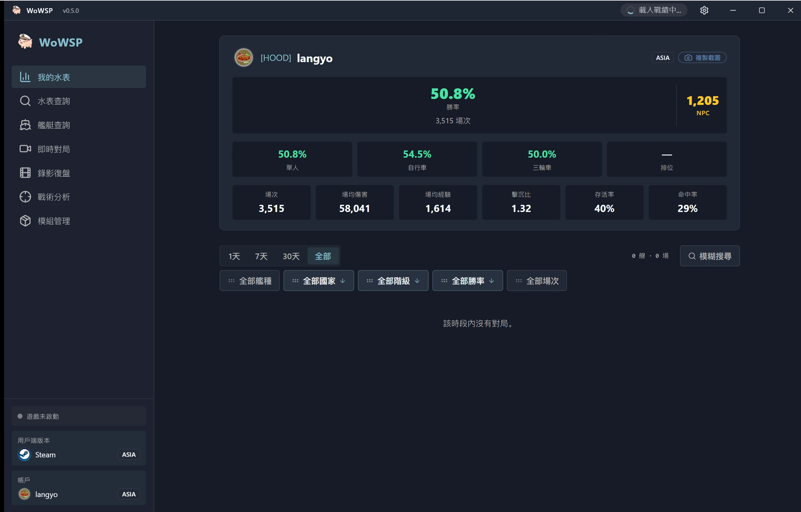

<h1 align="center">WoWSP</h1>

<strong>免費開源的《戰艦世界》戰況面板 — 重播回顧、遊戲內隊伍名單覆蓋層與戰績查詢，適用於 Windows。</strong>

[English](../../en/guides/README-wowsp.md) ·
[简体中文](../../zh-CN/guides/README-wowsp.md) ·
**繁體中文** ·
[日本語](../../ja/guides/README-wowsp.md) ·
[한국어](../../ko/guides/README-wowsp.md) ·
[Français](../../fr/guides/README-wowsp.md) ·
[Español](../../es/guides/README-wowsp.md) ·
[Русский](../../ru/guides/README-wowsp.md) ·
[العربية](../../ar/guides/README-wowsp.md)

> [!IMPORTANT]
> **WoWSP 完全免費開源，僅透過官方 [GitHub Releases](https://github.com/langyo/wowsp/releases) 發布。任何對它收費的人都不是作者 — 請勿付款；若您已付款，請申請退款並檢舉賣家。**

WoWSP 是 Windows 上的《戰艦世界》桌面面板。它會自動偵測您的遊戲安裝位置（Wargaming 啟動器、Steam、Lesta 或 360 版），並提供兩種運作模式：

- **獨立重播回顧** — 開啟任意 `.wowsreplay` 重播檔，在全像 3D 地圖上重溫整場對戰：每艘艦艇的航跡、砲彈、魚雷與飛機，以及每位玩家的戰鬥結果，全程無需啟動遊戲。
- **遊戲內覆蓋層** — 遊戲執行時按住 `Tab`，即可在對戰畫面上疊加顯示兩隊的名單與戰績；覆蓋層會在每次按下時重新錨定位置。

在這兩大功能之外，它還提供：

- 玩家與軍團戰績查詢，並提供「水表」生涯戰績卡。
- 艦艇百科，收錄完整科技樹、規格數據與裝甲檢視器。
- 模組中心與資源站，匯集熱門社群模組。
- Android 隨行版，可透過 Wi-Fi 直接從電腦端擷取重播檔，或以六位數配對碼從任何地方連線存取。

## 下載

Windows 10/11 — 前往 [GitHub Releases](https://github.com/langyo/wowsp/releases/latest) 取得最新的 `WoWSP_<version>_x64-installer-webview2.exe`（已內建 WebView2）；若您所在地連往 GitHub 速度緩慢，可改用可自動選擇鏡像的[下載頁面](https://wowsp.langyo.xyz/download)。Android 版由原始碼建置 — 詳見[建置指南](building.md)。

各檢視畫面、各 UI 語言的截圖均收錄於[網站圖庫](https://wowsp.langyo.xyz/#gallery)。

## 文件

架構、設計筆記與各類指南收錄於 [`docs/`](../../)，提供九種語言版本（英文與简体中文已完整翻譯），以 [lagrange](https://github.com/celestia-island/lagrange) 建置。 WoWSP 會回報極少量的匿名使用遙測——具體收集（與絕不收集）什麼見[遙測說明](../license/usage-telemetry.md)。

## 回饋與致謝

Bug 回報與測試回饋：QQ 群 **[1125770228](https://qm.qq.com/cgi-bin/qm/qr?k=b6kMIecv3d390ecZVWNQNWMFfLRVgcQ9&jump_from=webapi&authKey=NhNLVnIcIlmfnnDUCjpsra4C/zfciS1sYNjm5SV7x2RPhdP1CzOM91ObP9y9MMQV)**，或使用[網站](https://wowsp.langyo.xyz)上的回饋表單。重播解析與遊戲偵測原理改編自 [ApeRadar（海猴雷达）](https://github.com/zylalx1/ApeRadar)；前端外殼與建置基礎設施改編自 [shittim-chest](https://github.com/celestia-island/shittim-chest)。

## 授權條款

WoWSP 採用 **Synthetic Source License 1.0** 授權（[全文](https://github.com/langyo/wowsp/blob/master/LICENSE)）— 針對實質上由 AI 生成的程式碼庫，給予等同 Apache-2.0 的授權，唯一額外義務是在每份副本與衍生作品中保留 AI 生成揭露聲明。內嵌（vendored）的 [wows-toolkit](https://github.com/langyo/wowsp/tree/master/packages/tools/wowsunpack-vendor) 快照與獨立運作的 [pairing-relay](https://github.com/langyo/wowsp/tree/master/packages/pairing-relay) worker 仍保留其上游的 **MIT** 授權。
