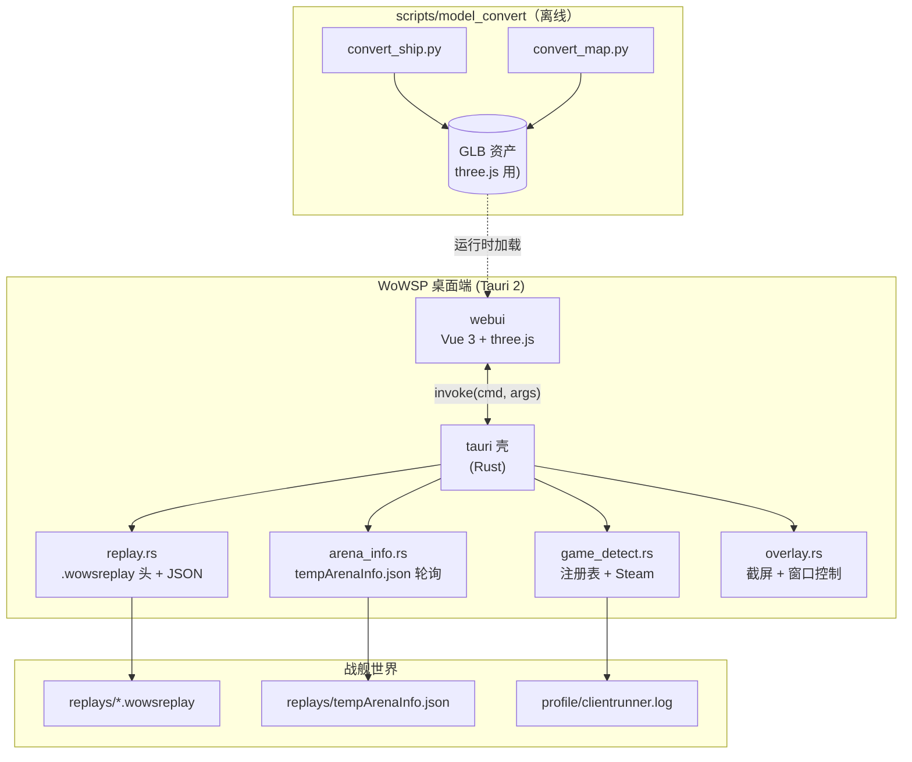

# 架构

> **版本**：0.1.0 —— 脚手架开发中。

## 范围

WoWSP 是一个 Cargo + pnpm 大仓：Tauri 2 桌面壳（Rust）+ Vue 3 前端，外加 Python 工具层（模型转换）、FastAPI mock 后端、lagrange 文档站点。

| 组件 | 技术 | 职责 | 状态 |
| --- | --- | --- | --- |
| **tauri** | Rust + Tauri 2 | 桌面壳：游戏检测、录像解析、覆盖层截屏 | 🟡 骨架 |
| **tauri_shared** | Rust | IPC 边界共享 DTO | 🟢 完成 |
| **webui** | Vue 3 + Vite（TSX） | 前端：录像复盘、全息地图、覆盖层阵容 | 🟡 骨架 |
| **mock** | Python + FastAPI | 供浏览器/e2e 开发的 mock 后端 | 🟡 骨架 |
| **model_convert** | Python | 船只/地图原生资产 → GLB（three.js 用） | 🟡 骨架 |
| **docs** | lagrange | 多语言文档站点 | 🟢 en + zhs |

## 架构图

## IPC 契约

webui 仅通过 `packages/app/tauri/src/main.rs` 注册的命令访问 Rust。命令名位于 `packages/webui/src/rpc.ts`；DTO 位于 `packages/app/tauri_shared/src/lib.rs`。mock 后端在 `/api/<cmd>` 下以 HTTP 镜像同一命令接口，因此桌面与浏览器的前端代码路径完全一致。
